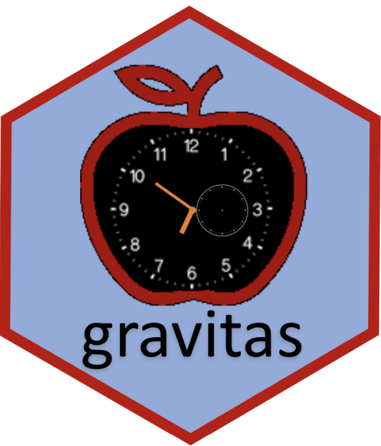

```{r setup, include=FALSE}
knitr::opts_chunk$set(echo = FALSE, message=FALSE, warning=FALSE, cache=TRUE,
  dev.args=list(bg=grey(0.9), pointsize=11))

knitr::read_chunk('R/main.R') 
knitr::read_chunk('R/theme.R')
```

```{r titleslide, child="components/titleslide.Rmd"}
```

---
class: center


```{r load}

```


# Motivation: Smart meter data for households

```{r load-data}
```

---
class: top left 

# Linear to cyclic

.pull-left[
.checked[
.smaller[
- **Cyclic time granularities:** exploring different periodicities e.g. hour-of-day, day-of-month or  hour-of-week, day-of-semester

- **Multiple observations for each level of cyclic granularity**

- summarize distribution of measured variables
]
]
]

.pull-right[
```{r linear2cyclic, animation.hook="gifski"}
```
]
---
class: top left 

# Summarize distribution

.pull-left[
.checked[
.smaller[
- **Cyclic time granularities:** exploring different periodicities e.g. hour-of-day, day-of-month or  hour-of-week, day-of-semester

- Multiple observations for each level of cyclic granularity

- **summarize distribution of measured variables**
]
]
]

.pull-right[
```{r allplot, animation.hook="gifski"}

```
]
---
class: top left

# Data structure and graphical mapping

.left-column[
<br>
<br>
-  extension of tsibble data structure
-  choose any two cyclic granularities: 
$C_i = \{A_1, A_2, \dots, A_K\}$ and $C_j = \{B_1, B_2, \dots, B_L\}$
- graphical mapping $(C_i, C_j, v)$

- $^{N_C}P_2$ displays
]

.right-column[

```{r graphical map, out.width="90%"}

```

]
---
class:left, top

# Relationship of cyclic granularities

.pull-left[
**<span style="color:firebrick"> <i> Clashes</i>:** pairs leading to empty sets

```{r clash, out.width="100%"}
```

]

.pull-right[
**<span style="color:firebrick"> <i> Harmonies</i>:** pairs leading to no empty sets


```{r noclash, out.width="100%"}
```
]

Still too many harmonies for display for large $N_C$
---
# Selecting harmonies with significant variation

.pull-left[
```{r question1, out.width="200%"}
```
]

.pull-right[
- significant differences between categories: <br> (a) no (b) yes
- Gestalt theory
- efficiently capture within and between group variation 
- compute threshold
 ]
---
# Rank selected harmonies <br> Median Maximum Pairwise Distance (MMPD)

.pull-left[
```{r questioncric}

```
]
.pull-right[
- rank harmonies (b) > (a)
- distances between probability distribution through Jensen-Shannon divergences
- normalizing constants through Fisher–Tippett–Gnedenko theorem
]
---
R package `gravitas`

.pull-left[
.animated.bounce[

]
]

.pull-right[
* construction of cyclic granularities and cyclic calendar algebra 
* check feasibility through harmony/clash
* select significant harmonies and rank them
* recommend prospective probability distributions 
]
---
class: top left


## An example : Electricity smart meter data

<i><small>Data source</i></small> : [<small><i>Department of the Environment and Energy, Australia</i></small>](https://data.gov.au/dataset/4e21dea3-9b87-4610-94c7-15a8a77907ef)

```{r read}
```
---

# Cyclic granularities considered for analysis

```{r search_gran}
```
<br>
<br> 

# Number of displays to analyze for exhaustive exploration

There are $^{7}P_2 = 42$ pair of granularities to look at placing one on the x-axis and the other on facet.
---

# Select only harmonies (16 out of 42 selected)

```{r rank harmony}

```

---
class: top left

# Select and rank significant harmonies (6 out of 16 selected)

```{r global_harmony}

```

---
class: top left

# Thank you

Slides: https://sayanigupta-ows2020.netlify.app/   

Materials: https://github.com/Sayani07/OWS2020 

Package (CRAN): v0.1.3

Package (Github) : https://github.com/Sayani07/gravitas  

<br>


Slides created with <i> Rmarkdown, knitr, xaringan, xaringanthemer</i>